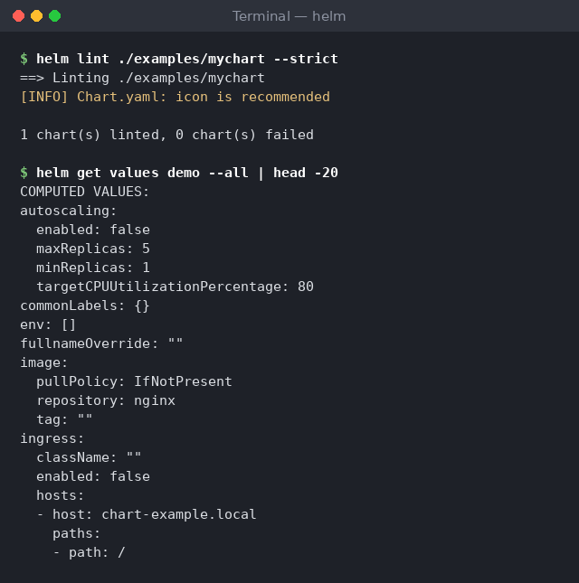

# Hands-On Walkthrough

Follow these steps in order. Each step shows the command to run and a screenshot
of the real output.

> The screenshots were captured from Helm v3.16.2 against a local test cluster
> (Kubernetes v1.30). Timestamps, chart versions, and app versions in your own
> output will differ, and that's expected.

---

## Step 1 — Confirm Helm is installed

```bash
helm version
```


---

## Step 2 — Add a repo and update

```bash
helm repo add bitnami https://charts.bitnami.com/bitnami
helm repo update
```


---

## Step 3 — Install a chart

```bash
helm install my-web bitnami/nginx
```
Note the Bitnami warning in the output. Since August 2025 only a limited set of
Bitnami images and charts are free. The chart still installs, but for real
workloads read [Bitnami catalog changes](troubleshooting.md#bitnami-catalog-changes-august-2025).


---

## Step 4 — Inspect the release

```bash
helm list
helm status my-web
```


---

## Step 5 — Create your own chart

```bash
helm create mychart
```
Then view the structure:
```bash
tree mychart      # or: Get-ChildItem -Recurse mychart
```


---

## Step 6 — Render the templates

```bash
helm template mychart
```


---

## Step 7 — Upgrade and roll back

This step uses the example chart in this repo, so it works offline and doesn't
depend on Docker Hub rate limits. Run it from the repo root.

```bash
helm install demo ./examples/mychart
helm upgrade demo ./examples/mychart --set replicaCount=3
helm history demo
helm rollback demo 1
helm history demo
```
Every upgrade and rollback adds a new revision. A rollback doesn't delete
history: revision 3 below is a copy of revision 1.


---

## Step 8 — Lint the chart and inspect the release

```bash
helm lint ./examples/mychart --strict
helm get values demo --all
```
`helm lint` catches chart mistakes before you deploy. `helm get values --all`
shows the final merged values the release is running with, which is the first
thing to check when a release doesn't behave as expected.



---

## Step 9 — Clean up

```bash
helm uninstall my-web
helm uninstall demo
```
