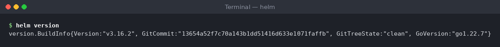
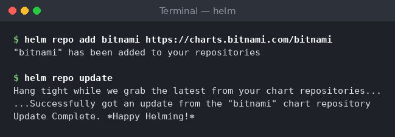
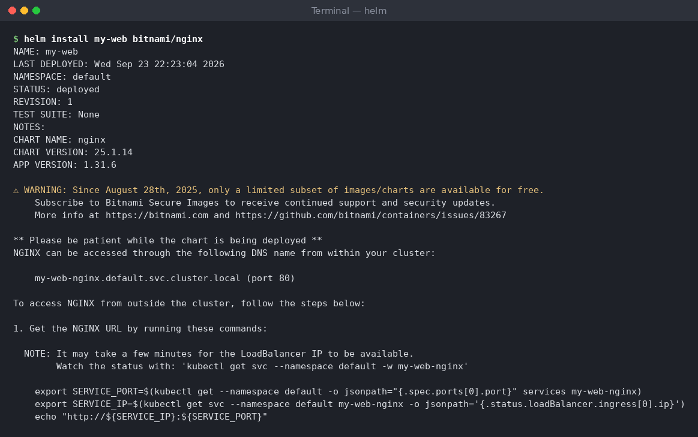
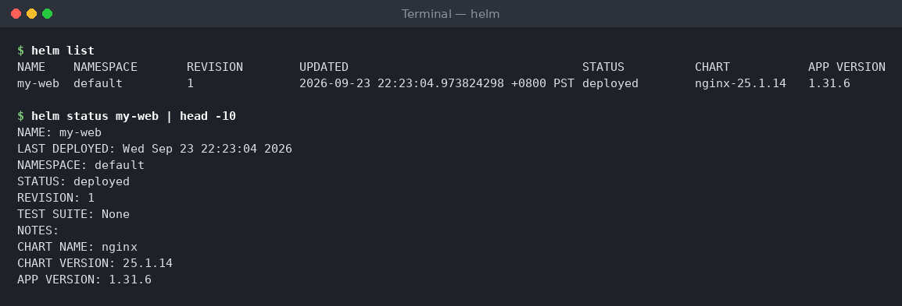
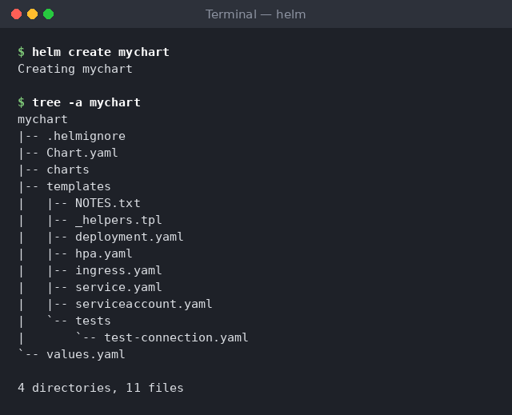
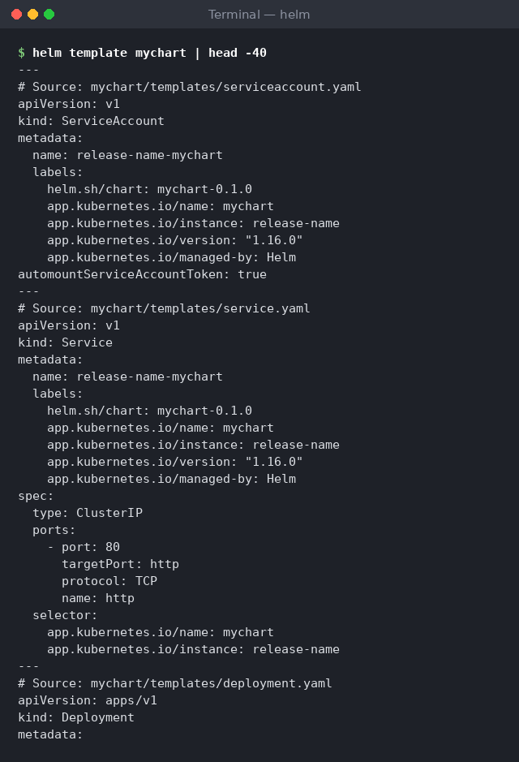
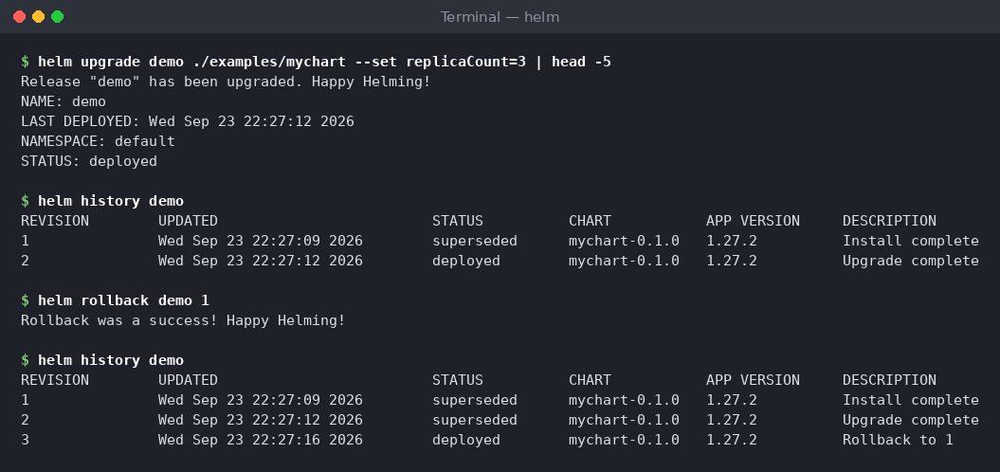

# Hands-On Walkthrough (with screenshot slots)

Follow these steps in order. Each step lists the command to run and a slot for a
screenshot. Capture each screenshot yourself and save it in the `../screenshots/`
folder with the filename shown, and the images will render automatically.

> Note: the images below will show as broken links until you add the PNG files.
> That's expected. The commands and expected output are documented either way.

---

## Step 1 — Confirm Helm is installed

```bash
helm version
```
Expected:
```
version.BuildInfo{Version:"v3.16.2", GitCommit:"...", GoVersion:"go1.22.7"}
```


---

## Step 2 — Add a repo and update

```bash
helm repo add bitnami https://charts.bitnami.com/bitnami
helm repo update
```
Expected:
```
"bitnami" has been added to your repositories
...
Update Complete. ⎈Happy Helming!⎈
```


---

## Step 3 — Install a chart

```bash
helm install my-web bitnami/nginx
```


---

## Step 4 — Inspect the release

```bash
helm list
helm status my-web
```


---

## Step 5 — Create your own chart

```bash
helm create mychart
```
Then view the structure:
```bash
tree mychart      # or: Get-ChildItem -Recurse mychart
```


---

## Step 6 — Render the templates

```bash
helm template mychart
```


---

## Step 7 — Upgrade and roll back

```bash
helm upgrade my-web bitnami/nginx --set replicaCount=3
helm history my-web
helm rollback my-web 1
```


---

## Step 8 — Clean up

```bash
helm uninstall my-web
helm uninstall mychart 2>$null
```
